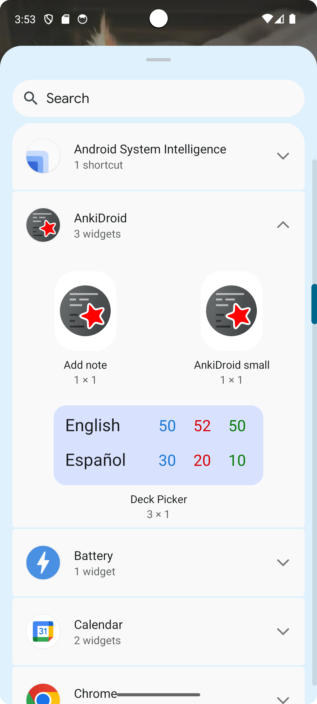
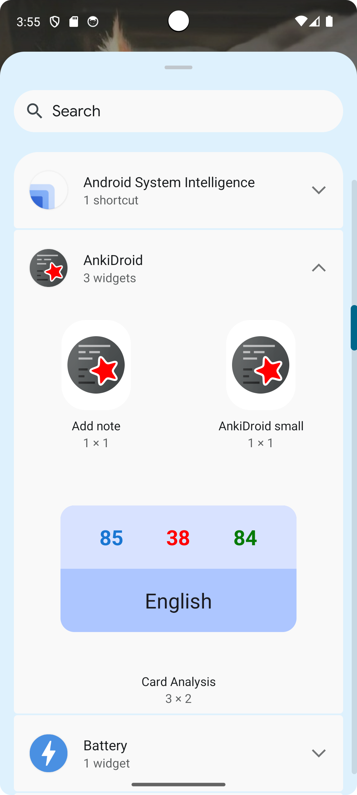
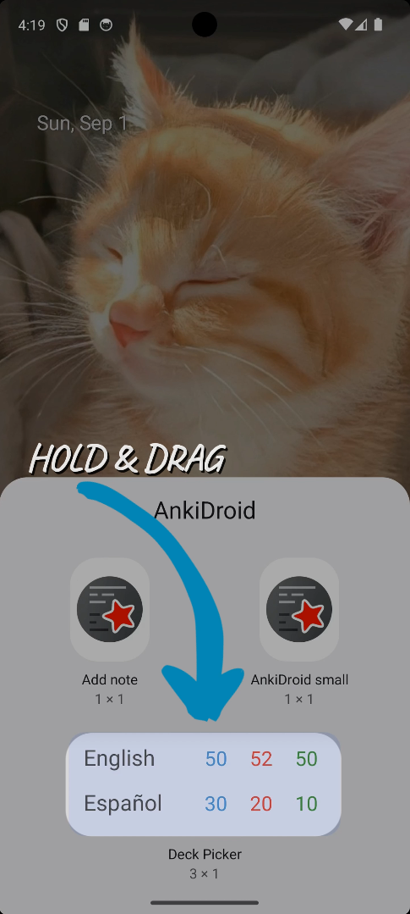
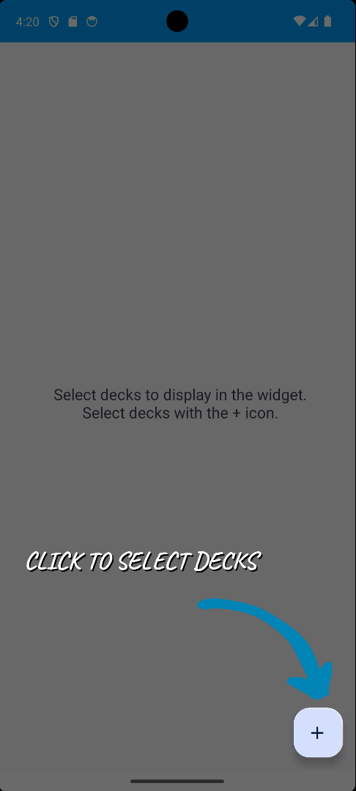
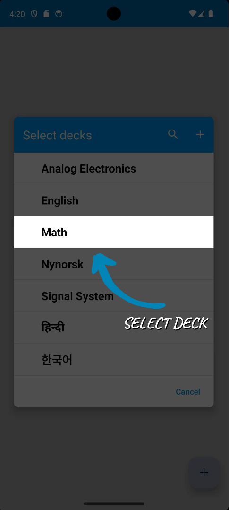
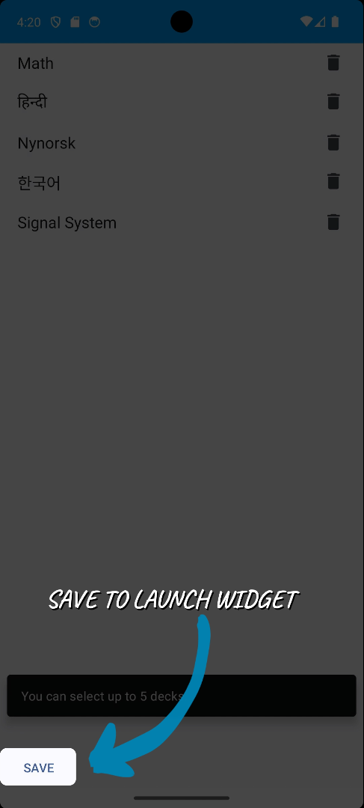
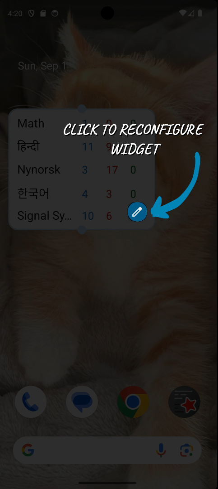

<h1 align="center">
  

    
    Anoop
  

  
2024

  

     <a href="[AnkiDroid](https://github.com/ankidroid/Anki-Android)">AnkiDroid</a> 
  

</h1>

## My mentors
[David Allison](https://github.com/david-allison) | [Arthur Milchior](https://github.com/Arthur-Milchior)

## Project Details

[AnkiDroid](https://github.com/ankidroid/Anki-Android) is a companion Android application for [Anki](https://github.com/ankitects/anki), a 
flashcards application that helps people learn and memorize a diverse variety of topics. 

[Additional Widgets](https://summerofcode.withgoogle.com/programs/2024/projects/w1n3pqnM) is mainly about
* Introducing the Deck Picker Widget.
  

    
  

* Introducing the Card Analysis Widget.
    

    
    

## Results

### Deck Picker Widget
The Deck Picker Widget offers users a convenient display of their decks, showcasing the number of cards that are new, in learning, and due for review, all at a glance. 
This display-only widget allows users to quickly review any deck by simply clicking on it directly from the widget. With a maximum of five decks that can be selected, 
users can reconfigure their widget by holding it down, making it easy to customize their overview. This feature-rich widget provides a seamless way for users to stay
on top of their study progress without having to open the app.

### How to use

       
    
    

    
    

### Working

    

