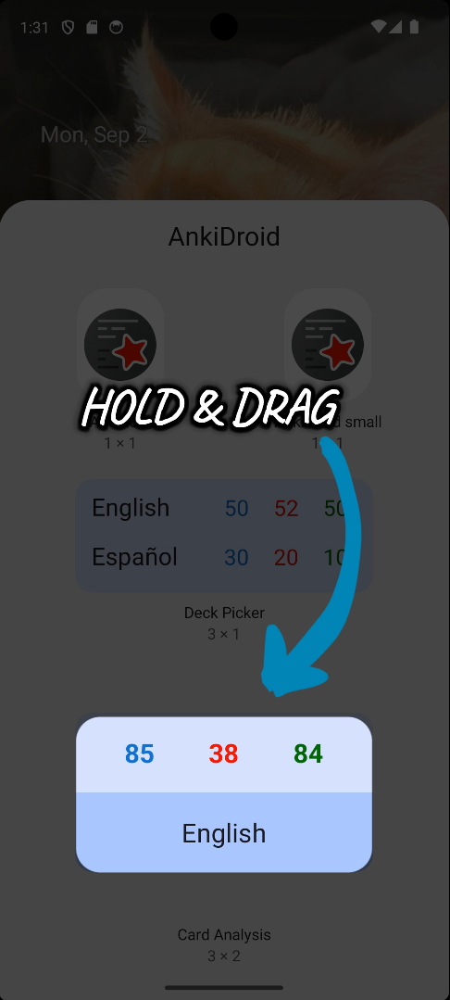
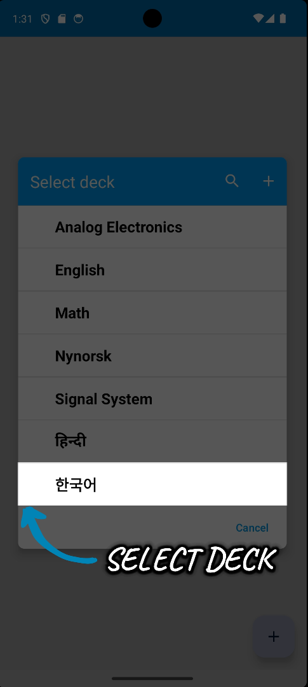

<h1 align="center">Anoop 2024  
  <a href="[AnkiDroid](https://github.com/ankidroid/Anki-Android)">AnkiDroid</a> </h1>

## 🌼My mentors
[David Allison](https://github.com/david-allison) | [Arthur Milchior](https://github.com/Arthur-Milchior) | [Shridhar Goel](https://github.com/ShridharGoel)

## 🌸Project Details

[AnkiDroid](https://github.com/ankidroid/Anki-Android) is a companion Android application for [Anki](https://github.com/ankitects/anki), a 
flashcards application that helps people learn and memorize a diverse variety of topics. 
Ankidroid used to lack convenient access to key study management features directly from their device's home screen. 
This inefficiency hampers user engagement and productivity. As improvements, I plan to address these challenges by implementing widgets for Ankidroid, focusing on three key areas: Deck Analysis, Card Analysis, and Cards Due. 
My Proposal regarding the project can be seen [here](https://docs.google.com/document/d/1VLYzRhUfZdcgRViFrj_w5ASLvzz448aISbgRCdpIafE/edit?usp=sharing)

My project, titled "[Additional Widgets](https://summerofcode.withgoogle.com/programs/2024/projects/w1n3pqnM)", was mainly about
* Introducing the Deck Picker Widget.
  

    
  

* Introducing the Card Analysis Widget.
    

    
    

## 🌻Results

### Deck Picker Widget
The Deck Picker Widget offers users a convenient display of their decks, showcasing the number of cards they should review today, all at a glance. 
This widget allows users to quickly review any deck by simply clicking on it directly from the widget. With a maximum of five decks that can be selected, 
users can reconfigure their widget by holding it down, making it easy to customize their overview. This feature-rich widget provides a seamless way for users to stay
on top of their study progress without having to open the app. Live preview can be seen [here](https://youtube.com/shorts/QCXAqqLnJfo)

### How to use

       
    
    

    
    

### Card Analysis Widget
The Card Analysis Widget delivers a detailed view of a single deck, presenting the number of cards they should review today. Unlike the Deck Picker Widget,
which covers multiple decks, this widget is dedicated to offering an in-depth focus on one specific deck. Users can personalize their widget by pressing and holding it,
making it a straightforward tool for staying engaged with their study routine directly from the home screen, without the need to open the app. Live preview can be seen [here](https://youtube.com/shorts/wriIqi-N-QU)

### How to use 

    
    

## Working
Since both the Deck Picker Widget and the Card Analysis Widget function similarly, as outlined in the mind map below, their operation can be easily understood in the same context as

    

## 📂 Pull Requests

Here's a list of the pull requests I created during GSoC 2024:

1. [[GSoC'24] Introducing AnalyticsWidgetProvider as ancestor of all widget classes. #16545](https://github.com/ankidroid/Anki-Android/pull/16545)
2. [[GSoC'24] Deck Picker Widget #16450](https://github.com/ankidroid/Anki-Android/pull/16450)
3. [[GSoC'24] Card Analysis Widget . #16982](https://github.com/ankidroid/Anki-Android/pull/16982)

## ✨ Outcome

This project successfully elevated the AnkiDroid app by implementing the Deck Picker and Card Analysis Widgets, delivering a more refined and accessible experience. These additions are designed to enhance user engagement, making it easier to monitor and manage study sessions directly from the home screen.
Note: I checked for accessibility issues using the Android Accessibility Scanner to ensure that the widgets provide an accessible experience for all users.

## 🌼Future Plans
I plan to continue contributing to the AnkiDroid community, but not being that much active for next two months. While I reduced the scope of my project to focus on the Deck Picker and Card Analysis Widget, I look forward to exploring the possibility of implementing the left widget post-GSoC.
